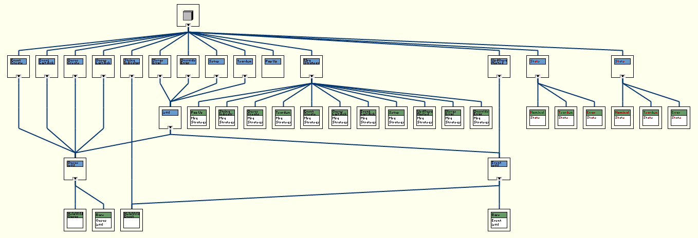
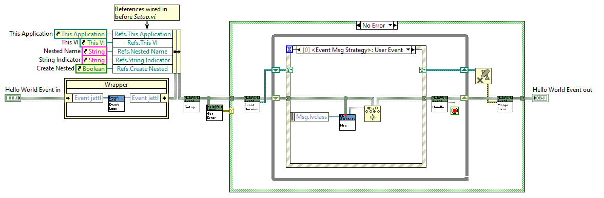

# jettl

*Dedicated to Stephen Loftus-Mercer for his pioneering work in introducing interfaces to LabVIEW development.*

*Please message me with your suggestions on how I should demonstrate more clear explanations, what I can do to improve the codebase for the developers needs, and examples you'd like to see. Especially this.*

`jettl` is a lightweight library used for decorating developed classes with either the `Queue` interface or `Event` interface via composition and implementation of the methods from either of the implemented interfaces. Included here are crucial design patterns including Strategy Pattern, Decorator Pattern, State Pattern, and Observer Pattern. SOLID principles, especially dependency inversion/injection, hence strategy pattern for dynamic dispatch messaging.

## Motivation

For a little over a year (currently 2025), I have had success designing applications to interface instruments to our nuclear fusion experiments, control XY stage motors to correlate and display 3D images via a topological scanning laser readout, and perform PID autotune algorithms for high efficiency RF antenna matching circuits. I wrote all of these applications using the [National Instruments Actor Framework](https://education.ni.com/badges/resources/984/actor-framework). Along the way, having learned about the [SOLID Design Principles](https://en.wikipedia.org/wiki/SOLID) and [Design Patterns](https://en.wikipedia.org/wiki/Software_design_pattern), I had been eager to apply these principles and design patterns. Being intimately involved with the source code of the [Actor Framework](https://education.ni.com/badges/resources/984/actor-framework), I ventured to build a library that uses common elements from the Actor Framework, Derrick Bommarito's [lv-artifex](https://github.com/illuminated-g/lv-artifex), and the many talks given by [Dmitry Sagatelyan](https://forums.ni.com/t5/LabVIEW-Champions-Directory/LabVIEW-Champion-Dmitry-Sagatelyan/ta-p/3536802) on the Agile Software Design Principles, SOLID principles, and Context-Agnostic Actors. `jettl` was born.

## Advantage

- **Composition over inheritance**. More specifically, interface composition. Interface composition allows for dynamic wrapping of classes via their common interface. In particular, debugging, unit testing, swapping panels, etc.
- **Separation of Concerns**. Actors are split into `Queue Actors` (following the tree messaging hierarchy) and `Event Actors` (which can only be created by `Queue Actors`). Dynamic creation of `Event Actors` can occur leading to `Event Actors` being able to enqueue messages to a `Queue Actors` Caller, Self, and Nested Actors, dynamically.
- **Messaging**. Both `Queue Actors` and `Event Actors` use DVR queues and DVR events to send messages. These messages are exclusively interface driven messages, fully abstracted. Simple methods (`Queue Caller`, `Queue Self`, `Queue Nested`, `Event Self`, `Event Nested`) are used to send a message to the respective DVR.
- **Reference Abstaction**. The `Queue Actors` DVR Queues are fully abstracted away. The `Event Actors` have their DVR Event available to the developer, giving rise to a observer pattern, allowing cross tree messaging via the Event Actors.

## Examples

A Hello World Example is here in the project in `jettl\src\jettl.proj`. Run the `Main Hello World.vi` to spawn a `Queue` and an `Event` (acting as the front panel). This is where you should start when learning `jettl`, by example.

# Things Necessary To Become Successful

- Script messages
- Script right click menu for creating template for `Queue`, creating the decorator override methods with necessary functionality
- Script right click menu for creating template for `Event`, creating the decorator override methods with necessary functionality
- For `Panel Event`, dedicate message methods for `Show Panel`, `Hide Panel`, `Change Panel`
- Interchanging panels example using the interface composition based State Pattern
- Subpanel example
- `Notifier jettl`
- `Periodic Message Notifier` example
- `Channel Wire jettl`
- Debug / Unit Test class wrapping. Some kind of diagram disable in the developed actor `Decorator.vi`, surrounding the (yet to be made) `Debug Queue.lvclass`. That way debug code does not exist in Base classes, and is held exclusively in the `Debug Queue.lvclass`.

## Documentation

look in the `doc` folder for the `main.pdf` for the on going documentation for `jettl`.
Older outdated documentation in the `doc_old` folder.
These images are high resolution, click them to zoom in and see the simple algorithm of data flow.

## What I'm Working On

### Detail the strategy pattern used for Messaging in jettl

### Event jettl
Controls and indicators are updated with property nodes.
Note an excellent idea: https://www.youtube.com/watch?v=RJ7FHrzIu68&t=270s: 13:29
For functionality of `Add Reference to Class Data`
These can be in message methods.

### Queue jettl not enforced, but encouraged to use a double layer for the Queue jettl i.e. a single Queue jettl top layer and infinite Queue jettls in the second layer.
This provides very easy to understand messaging from self up to caller, and back down to a nested.
The Queue jettls are for:
- creating the Event jettl, Notifier jettl, and Channel Wire jettl,
- *mainly* for transporting the necessary references to other jettls, and
- communicating with other application instances / executables.
This transporting of references leads to the observer pattern distributed system.
This change in thinking of a distributed model is easier to understand as well.
Note: The Event jettls are inherently a single layer since they cannot create Queue jettls or Event jettls

### Refactor Decorator Pattern:
Requires one context class for decorating multiple times.
Is there a way to use the **four** videos to refactor the decorator pattern without class inheritance?
This should be applied to jettl for multiple wrappings of objects inheriting from the same interface.

### Message method execution: shared clone
A shift in the developers' mindset: Develop message methods at the interface level.
Things that can change for the message:
1. `Rename jettl Msg`: right click library
2. `Change Inputs For jettl Msg`: right click interface method (change connector pane in interface method first)

### in message classes, take away the `_` leading the method name

This should be where the new queue nested should be sent via event to update the Queue Nested in jettl Event Actor. Yes, it is not instant, but gives the Event Actor(s) the reference so they can send messages to this newly created Queue Actor. Beware, here with these being async processes, temporal issue may arise..

Comments about the Queue Mailbox.
Ideally speaking, there would be a Mailbox interface that Queue Mailbox implements.
But since the interface checkbox is checked and cannot be changed: "Data Value References - Restrictions On New and Delete: Enabled: Restrict references of this class type to member VIs of this class", that means that Interfaces cannot be a DVR.
Further, this immediately voids any dependency inversion since an object in a DVR cannot change it's object, by definition such as what dependency inversion does.
Therefore, the Queue Mailbox in the Queue Mailbox library cannot be marked private, allowing other classes in the jettl library have access to it via the DVR.
This really isn't a problem though since the Queue Mailbox library is marked private, so nothing outside the jettl can use this class and DVR methods, encapsulating the DVR, as intended by jettl.

post question about renaming project method

Create the necessary methods for sending messages:
Find and replace the old ones :)

TODO jettl Test Panel
Automatically generated test panel providing buttons / necessary inputs for all messages the actor expects.
have the test panel display payloads from messages received.
Could rename message to `NAME jettl Msg.lvlib` for script to find messages.
This “Test Panel” can be a specialty “Test Panel Event jettl” which communicates with the “Developed Queue jettl” or “Developed Event jettl”. 
These jettls (Actors) are designed to be modular without dependencies of other jettls.
Of some test bench with a “Unit Test Queue jettl” which creates both the “Developed Queue jettl” and the “Test Panel Event jettl” for the front panel testing you refer to.
This is excellent and shows very quickly which messages belong to the jettl.. and potentially which messages it is able to send (since these are static on the block diagram).
Since the jettls use the decorator pattern, there might be some merit to having a “Debug jettl” which can act as a tertiary wrapping layer around any jettl

TODO: Observer Pattern
When sending the `Subscribe Msg` up the tree and down to the Actor to be subscribed to, also send with it the Queue Self so that the jettl that is created can `Unsubscribe`.
This `Unsubscribe` is like the Last Ack, but to the creator of the Queue jettl across the tree.
Yes, this `Queue jettl` across the tree gets `Unsubscribe` AND the actual Queue jettl Creator gets the Last Ack.

Communicating across the tree requires the `Observer jettl`.
Communicating across the tree can happen with `Queue jettls` and `Event jettls` (Ex: Update front panel)
`Observer Queue jettl` has Queues under the hood, but act as the observer pattern, limited like Event jettls where it cannot create jettls AND only have on their private data the Observer jettl DVR. Note that Observer Queue jettls CAN send over Events across the tree

To fulfill the observer requirement, the necessary Mailboxes are sent to the Mediator

### Batch message necessary..? Or developer should make custom message that executes 
Enqueues? Message methods:
back to back to back to ..
This is a single message that is sent AND this message contains 

### jettl conventions:
Icon text: (NRE, SCRE, PCRE)
Label used for ALL methods / classes
boarder is RED for private methods / classes

That means the text is always BLACK, boarders can be RED.

Access Scope
Public and Private

Rule:
- Nested Libraries should be marked private, otherwise, put the nested library outside the containing library
- Classes should be within a library AND marked private

Libraries / Interfaces / Classes / Methods are private if they themselves are private

If Library containing is private, then banner text is RED.

Banners / Banner Text
Library
- Private: red text. Public: black text
Interface
- Private: red text. Public: black text
Class
- Private: red text. Public: black text
Method
- Private: red text. Public: black text
Control
- Private: red text. Public: black text

Label: Remove “.vi”

Icon
DD       DD    (or combos of “  “, DD, SD)
SCRE

### no assembler / mediator?

###
Maybe instead of sharing the individual mailboxes with Event jettls.. there is an object that holds them inside and this is also a by-reference that has only one address so if an Event jettl uses the (i.e.) Created Queue Mailbox, then it is already updated without message since pointing to the reference that holds the references to all the Queue jettls Mailboxes

### Assember
Maybe there is some assembler, with a map inside holding the references of all the DVR maps? They’re unique 

### Observer
With Observer Actors: should eliminate the developers use of DVRs since cross tree communication is permitted

virtual folders are not saved on disc.
These are only convenience in the LabVIEW project.

### Error idea to consider
There might be unnecessary overhead with the `Is Error.vi` in the `Merge Error` and `Override Error` overrides.
Instead this `Is Error` can be put at the front of the `Handle Error.vi` override.
Note that there are four occurrences of these.

Delete images-readme

old_doc -> misc
- combine some docs into main

refer to scarfe notes
antidoc etc

Queue Create -> Create Queue
Event Create -> Create Event
Queue Last Ack -> Last Ack Queue
Event Last Ack -> Last Ack Event