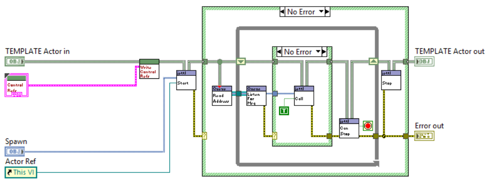
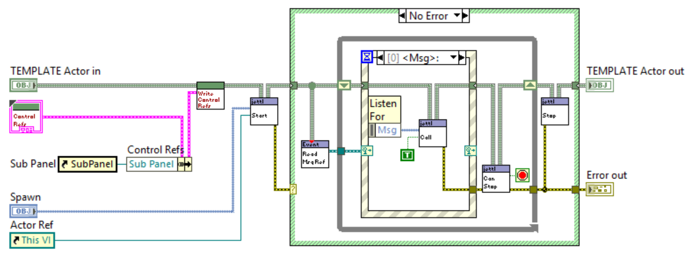
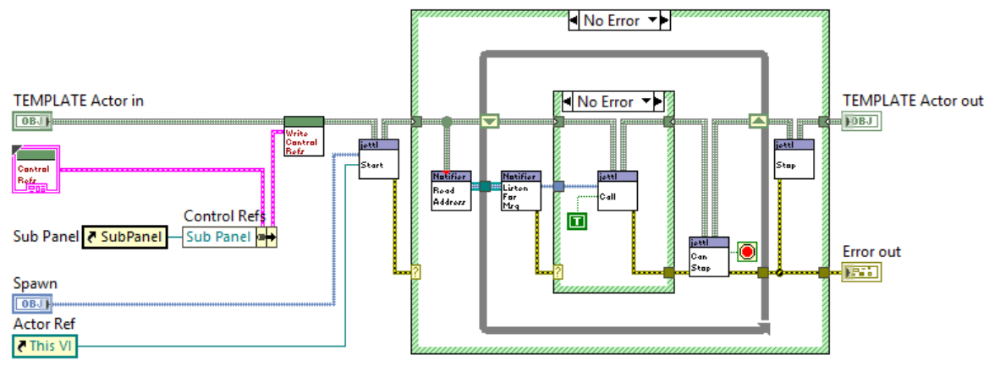
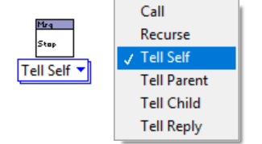

# jettl

**A modern LabVIEW Actor Model implementation for building scalable applications.**

*Dedicated to [Stephen Loftus-Mercer](https://www.linkedin.com/in/stephen-loftus-mercer/) for his pioneering work in introducing interfaces to the LabVIEW environment.*
*This work would not be possible without this feature.*

## Installation

Install the published package on **[VIPM](https://www.vipm.io/package/nathan_davis_lib_jettl/)**.

Navigate to the `Data Communication` -> `jettl` palette and the pull-down menu to find tools in `Tools` -`jettl Tools`.

*Palette.*

This library is compatible with **LV 2020 and beyond**.
Note: If using LV2020, please consider using *LV 2020 SP1* and due to issues resolved here: [LabVIEW 2020 SP1 Bug Fixes](https://www.ni.com/en/support/documentation/bugs/20/labview-2020-sp1-bug-fixes.html?srsltid=AfmBOooUbuV9waHiF74KkrteQY7SRCENumzj1XCdQMWldAIuQMDW1sM6).

## Advantages

- **Relative Actor Relations**.
Every Actor in the system has itself, called `Self`.
Along with one `Parent` and N many `Child` Actors.
- **Address Abstaction**.
The address of an Actor is abstracted away from the developer, unless more advanced testing required.
- **Messaging**.
Actor messaging follow a strict tree hierarchy of messaging.
Actors internally use events to send messages.
These messages are exclusively interface driven messages, fully abstracting the dependence between Actors.
- **Composition over inheritance**.
More specifically, interface composition.
Interface composition allows for dynamic wrapping of classes via their common `Actor` interface.
In particular, debugging, unit testing, etc.
Dynamic decoration of actors, opposed to static class inheritance.
- **Inline Object Manipulation in Event Structure**.
Every Actor comes with an event structure, which has the central object wire passed through it leading to a true by-value design.
- **Message Output**.
Messages have scripted outputs, such as message inputs, used for transporting data between decorated actors.
- **Various Message Transport Actors**.
There currently three actors that distinguish between Queue, Event, and Notifier messaging.
- **Statically Typed Messaging**.
All messages are interface coupled and statically determined execution provides for ease in understanding the relative actor system messaging.
- **Child Actor UID Mapping**.
Internally, Child Actor UIDs (Unique Identifiers) are automatically inserted into a map.

## Documentation

Look in the `doc` folder for the `main.pdf` for the ongoing documentation.
Due to recent rapid development, this documentation will likely be outdated.
Please refer to the [Videos](https://www.youtube.com/@nathandavis6612), for more recent explanations.

*Queue Actor.*

*Event Actor.*

*Notifier Actor.*

*Polymorphic Message.*

*Message implementaion.*

## Motivation

Over the the course of a couple years, I have designed applications to interface instruments for control of nuclear fusor, control XY stage motors to correlate and display 3D images via the data from a topological scanning laser, perform PID autotune algorithms for high efficiency RF antenna matching circuits, and control mass flow controllers for pressure and flow measurement, mocking a subsystem of a reactive ion etch system.
These applications have been written using the [National Instruments Actor Framework](https://education.ni.com/badges/resources/984/actor-framework).
Through the process, I learned about the [SOLID Design Principles](https://en.wikipedia.org/wiki/SOLID) and [Design Patterns](https://en.wikipedia.org/wiki/Software_design_pattern).
I had been eager to apply these principles and design patterns to my own Actor Model.
Being intimately involved with the source code of the [Actor Framework](https://education.ni.com/badges/resources/984/actor-framework), I ventured to build this `jettl` library.
It follows the Actor Model and takes great inspiration from the Actor Framework, Derrick Bommarito's [lv-artifex](https://github.com/illuminated-g/lv-artifex), and ideas presented in the many talks given by [Dmitry Sagatelyan](https://forums.ni.com/t5/LabVIEW-Champions-Directory/LabVIEW-Champion-Dmitry-Sagatelyan/ta-p/3536802) on the Agile Software Design Principles, SOLID principles, and Context-Agnostic Actors.
This work would not be possible without the contributions of those developers that have come before me.