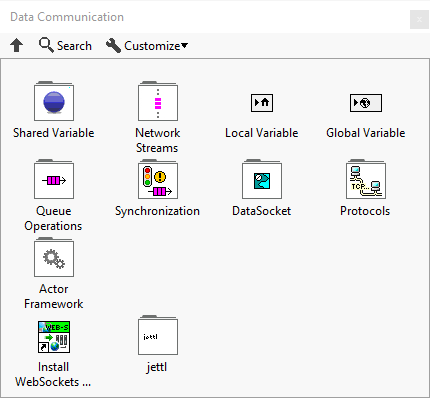
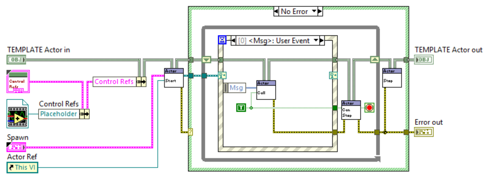
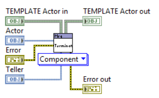

# jettl

 

**Install the most recent published package on [VIPM](https://www.vipm.io/package/nathan_davis_lib_jettl/)**

*Dedicated to Stephen Loftus-Mercer for his pioneering work in introducing interfaces to the LabVIEW environment.*

`jettl` implements a SOLID-driven Actor Model architecture that unifies functional, procedural, and object-oriented paradigms.

[Discord](https://discord.gg/tVkvTyBxqa)

[Videos](https://www.youtube.com/@nathandavis6612)

After installation from [VIPM](https://www.vipm.io/package/nathan_davis_lib_jettl/), navigate to the `Data Communication` -> `jettl` palette:

And find the native tools for jettl in from the pull-down menu `Tools` -> `jettl Tools`.

A note on LabVIEW version: This library is compatible with LV 2020 and beyond. If using LV2020, please consider using LV 2020 SP1 and beyond due to issues resolved here: [LabVIEW 2020 SP1 Bug Fixes](https://www.ni.com/en/support/documentation/bugs/20/labview-2020-sp1-bug-fixes.html?srsltid=AfmBOooUbuV9waHiF74KkrteQY7SRCENumzj1XCdQMWldAIuQMDW1sM6)

## Motivation

Over the the course of a couple years, I have designed applications to interface instruments for control of nuclear fusor, control XY stage motors to correlate and display 3D images via the data from a topological scanning laser, perform PID autotune algorithms for high efficiency RF antenna matching circuits, and control mass flow controllers for pressure and flow measurement, mocking a subsystem of a reactive ion etch system.
These applications have been written using the [National Instruments Actor Framework](https://education.ni.com/badges/resources/984/actor-framework).
Through the process, I learned about the [SOLID Design Principles](https://en.wikipedia.org/wiki/SOLID) and [Design Patterns](https://en.wikipedia.org/wiki/Software_design_pattern).
I had been eager to apply these principles and design patterns to my own Actor Model.
Being intimately involved with the source code of the [Actor Framework](https://education.ni.com/badges/resources/984/actor-framework), I ventured to build this `jettl` library.
It follows the Actor Model and takes great inspiration from the Actor Framework, Derrick Bommarito's [lv-artifex](https://github.com/illuminated-g/lv-artifex), and ideas presented in the many talks given by [Dmitry Sagatelyan](https://forums.ni.com/t5/LabVIEW-Champions-Directory/LabVIEW-Champion-Dmitry-Sagatelyan/ta-p/3536802) on the Agile Software Design Principles, SOLID principles, and Context-Agnostic Actors.
This work would not be possible without the contributions of those developers that have come before me.

## Advantages

- **Relative Actor Relations**.
Every Actor in the system has itself, called `Self`.
Along with one `Creator` and N many `Created` Actors.
- **Address Abstaction**.
The address of an Actor is abstracted away from the developer, unless more advanced testing required.
- **Messaging**.
Actor messaging follow a strict tree hierarchy of messaging.
Actors internally use events to send messages.
These messages are exclusively interface driven messages, fully abstracting the dependence between Actors.
- **Composition over inheritance**.
More specifically, interface composition.
Interface composition allows for dynamic wrapping of classes via their common `Actor` interface.
In particular, debugging, unit testing, etc.
- **Inline Object Manipulation in Event Structure**.
Every Actor comes with an event structure, which has the central object wire passed through it leading to a true by-value design.

## Documentation

Look in the `doc` folder for the `main.pdf` for the ongoing documentation for `jettl`.
Note, this documentation will likely be outdated due to recent rapid development.
Please refer to the [Videos](https://www.youtube.com/@nathandavis6612) linked above, for more recent explanations.

