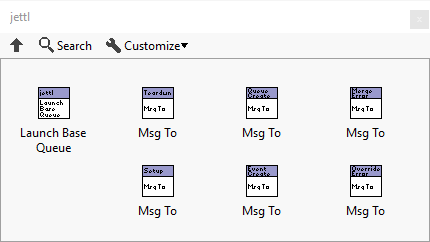
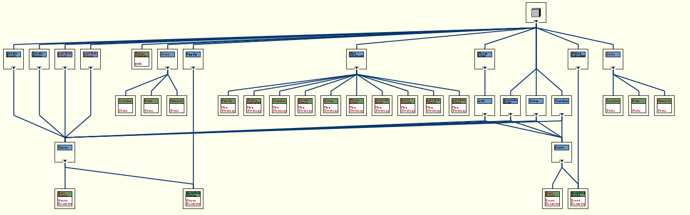
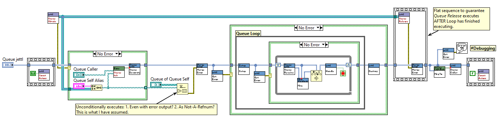
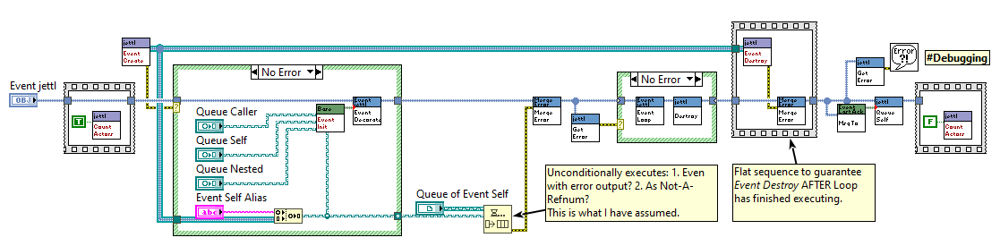

# jettl

*Dedicated to Stephen Loftus-Mercer for his pioneering work in introducing interfaces to LabVIEW development.*

*Please message me with your suggestions on how I should demonstrate more clear explanations, what I can do to improve the codebase for the developers needs, and examples you'd like to see. Especially this.*

`jettl` is a lightweight library used for decorating developed classes with either the `Queue` interface or `Event` interface via composition and implementation of the methods from either of the implemented interfaces. Included here are crucial design patterns including Strategy Pattern, Decorator Pattern, State Pattern, and Observer Pattern. SOLID principles, especially dependency inversion/injection, hence strategy pattern for dynamic dispatch messaging.

## Motivation

For a little over a year (currently 2025), I have had success designing applications to interface instruments to our nuclear fusion experiments, control XY stage motors to correlate and display 3D images via a topological scanning laser readout, and perform PID autotune algorithms for high efficiency RF antenna matching circuits. I wrote all of these applications using the [National Instruments Actor Framework](https://education.ni.com/badges/resources/984/actor-framework). Along the way, having learned about the [SOLID Design Principles](https://en.wikipedia.org/wiki/SOLID) and [Design Patterns](https://en.wikipedia.org/wiki/Software_design_pattern), I had been eager to apply these principles and design patterns. Being intimately involved with the source code of the [Actor Framework](https://education.ni.com/badges/resources/984/actor-framework), I ventured to build a library that uses common elements from the Actor Framework, Derrick Bommarito's [lv-artifex](https://github.com/illuminated-g/lv-artifex), and the many talks given by [Dmitry Sagatelyan](https://forums.ni.com/t5/LabVIEW-Champions-Directory/LabVIEW-Champion-Dmitry-Sagatelyan/ta-p/3536802) on the Agile Software Design Principles, SOLID principles, and Context-Agnostic Actors. `jettl` was born.

## Advantage

- **Composition over inheritance**. More specifically, interface composition. Interface composition allows for dynamic wrapping of classes via their common interface. In particular, debugging, unit testing, swapping panels, etc.
- **Separation of Concerns**. Actors are split into `Queue` actors (following the tree messaging hierarchy) and `Event Actors` (which can only be created by `Queue` actors). Dynamic creation of `Event` can occur leading to an `Event` actor being able to enqueue messages to a `Queue` Creator, Self, Created Queue, and Created Event actors, dynamically.
- **Messaging**. Both `Queue` and `Event` actors use DVR queues and DVR events to send messages. These messages are exclusively interface driven messages, fully abstracted. Simple methods are used to send a message to the respective DVR.
- **Reference Abstaction**. The `Queue Actors` DVR Queues are fully abstracted away. The `Event` actors have their DVR Event available to the developer, giving rise to a observer pattern, allowing cross tree messaging via the Event Actors.

## Examples

A Hello World Example is here in the project in `src\jettl.proj`. Run the `Main Hello World.vi` to spawn a `Queue` and an `Event` (acting as the front panel). This is where you should start when learning `jettl`, by example.

# Things Necessary To Become Successful

- Script messages
- Script right click menu for creating template for `Queue`, creating the decorator override methods with necessary functionality
- Script right click menu for creating template for `Event`, creating the decorator override methods with necessary functionality
- For `Panel Event`, dedicate message methods for `Show Panel`, `Hide Panel`, `Change Panel`
- Interchanging panels example using the interface composition based State Pattern
- Subpanel example
- `Notifier`
- `Periodic Message Notifier` example
- `Channel Wire`
- Debug / Unit Test class wrapping. Some kind of diagram disable in the developed actor `Decorator.vi`, surrounding the (yet to be made) `Debug Queue.lvclass`. That way debug code does not exist in Base classes, and is held exclusively in the `Debug Queue.lvclass`.

## Documentation

Look in the `doc` folder for the `main.pdf` for the ongoing documentation for `jettl`.
Older outdated documentation in the `doc_old` folder.
*These images are high resolution, click them to zoom in and see the simple algorithm of data flow.*

## What I'm Working On

### Detail the strategy pattern used for Messaging in jettl

### Event
Controls and indicators are updated with property nodes.
Note an excellent idea: https://www.youtube.com/watch?v=RJ7FHrzIu68&t=270s: 13:29
For functionality of `Add Reference to Class Data`
These can be in message methods.

### Queue not enforced, but encouraged to use a double layer for the Queue i.e. a single Queue top layer and infinite Queues in the second layer.
This provides very easy to understand messaging from self up to caller, and back down to a nested.
The Queues are for:
- creating the Event, Notifier, and Channel Wire,
- *mainly* for transporting the necessary references to other actors, and
- communicating with other application instances / executables.
This transporting of references leads to the observer pattern distributed system.
This change in thinking of a distributed model is easier to understand as well.
Note: The Events are inherently a single layer since they cannot create Queues or Events

### Refactor Decorator Pattern:
Requires one context class for decorating multiple times.
Is there a way to use the **four** videos to refactor the decorator pattern without class inheritance?
This should be applied to jettl for multiple wrappings of objects inheriting from the same interface.

### in message classes, take away the `_` leading the method name

### Test Panel
Automatically generated test panel providing buttons / necessary inputs for all messages the actor expects.
have the test panel display payloads from messages received.
Could rename message to `jettl Msg NAME.lvlib` for script to find messages.
This “Test Panel” can be a specialty “Test Panel Event which communicates with the “Developed Queue or “Developed Event. 
These Actors are designed to be modular without dependencies of other Actors.
Of some test bench with a `Unit Test Queue` which creates both the “Developed Queue” and the “Test Panel Event” for the front panel testing you refer to.
This is excellent and shows very quickly which messages belong to the actor.. and potentially which messages it is able to send (since these are static on the block diagram).
Since the actors use the decorator pattern, there might be some merit to having a `Debug Queue` which can act as a tertiary wrapping layer around any actor.

### Observer Pattern
When sending the `Subscribe Msg` up the tree and down to the Actor to be subscribed to, also send with it the Queue Self so that the actor that is created can `Unsubscribe`.
This `Unsubscribe` is like the Last Ack, but to the creator of the Queue across the tree.
Yes, this `Queue` across the tree gets `Unsubscribe` AND the actual Queue Creator gets the Last Ack.

Communicating across the tree requires the `Observer`.
Communicating across the tree can happen with `Queue`s and `Event`s (Ex: Update front panel)
`Observer Queue` has Queues under the hood, but act as the observer pattern, limited like Events where it cannot create actors AND only have on their private data the Observer DVR. Note that Observer Queues CAN send over Events across the tree

To fulfill the observer requirement, the necessary Mailboxes are sent to the Mediator.

### Batch message
necessary..? Or developer should make custom message that executes 
Enqueues? Message methods:
back to back to back to ..
This is a single message that is sent AND this message contains 

### Assembler
Maybe there is some assembler, with a map inside holding the references of all the DVR maps? They’re unique 

### Observer
With Observer Actors: should eliminate the developers use of DVRs since cross tree communication is permitted

### Scripting
Go back and go through VI scripting repos
note: Message method execution should be set to shared clone

Project Right-click:
- jettl
   - Msg (Name) (these are public messages)
   - Queue (Name)
   - Event (Name)

Library Right-click:
- jettl
   - Msg (Name) (these are private messages)

Library Right-click:
If “jettl Msg xxxxxxxx.lvlib”:
`jettl Msg Rename`: (this is the normal scripting for message, checks if library is private)

Interface Right-click:
A shift in the developers' mindset: Develop message methods at the interface level.
If “jettl Msg xxxxxxxx.lvlib” and right-clicking interface:
`jettl Msg Change Inputs`: (this is the normal operation for creating the input connector pane)
right click interface method (change connector pane in interface method first)

### YouTube

Create YouTube video of a light introduction and hello world

advanced videos of sending messages, creating queues and events, sub panels, etc