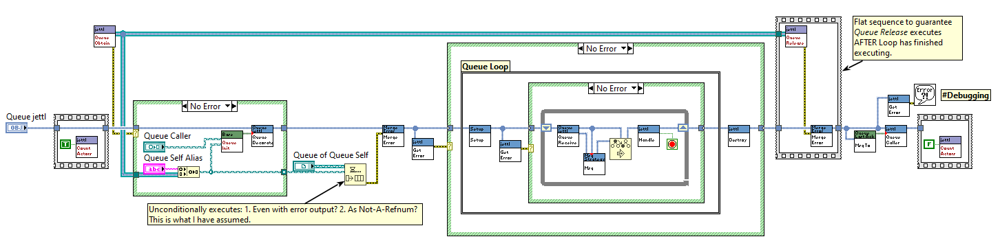
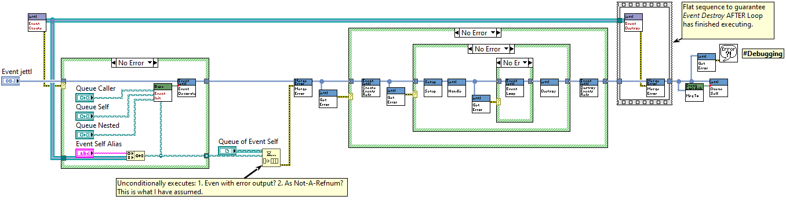

# jettl

*Dedicated to Stephen Loftus-Mercer for his pioneering work in introducing interfaces to LabVIEW development.*

*Please message me with your suggestions on how I should demonstrate more clear explanations, what I can do to improve the codebase for the developers needs, and examples you'd like to see. Especially this.*

`jettl` is a lightweight library used for decorating developed classes with either the `Queue jettl` interface or `Event jettl` interface via composition and implementation of the methods from either of the implemented interfaces. Included here are crucial design patterns including Strategy Pattern, Decorator Pattern, State Pattern, and Observer Pattern. SOLID principles, especially dependency inversion/injection, hence strategy pattern for dynamic dispatch messaging.

## Motivation

For a little over a year (currently 2025), I have had success designing applications to interface instruments to our nuclear fusion experiments, control XY stage motors to correlate and display 3D images via a topological scanning laser readout, and perform PID autotune algorithms for high efficiency RF antenna matching circuits. I wrote all of these applications using the [National Instruments Actor Framework](https://education.ni.com/badges/resources/984/actor-framework). Along the way, having learned about the [SOLID Design Principles](https://en.wikipedia.org/wiki/SOLID) and [Design Patterns](https://en.wikipedia.org/wiki/Software_design_pattern), I had been eager to apply these principles and design patterns. Being intimately involved with the source code of the [Actor Framework](https://education.ni.com/badges/resources/984/actor-framework), I ventured to build a library that uses common elements from the Actor Framework, Derrick Bommarito's [lv-artifex](https://github.com/illuminated-g/lv-artifex), and the many talks given by [Dmitry Sagatelyan](https://forums.ni.com/t5/LabVIEW-Champions-Directory/LabVIEW-Champion-Dmitry-Sagatelyan/ta-p/3536802) on the Agile Software Design Principles, SOLID principles, and Context-Agnostic Actors. `jettl` was born.

## Advantage

- **Composition over inheritance**. More specifically, interface composition. Interface composition allows for dynamic wrapping of classes via their common interface. In particular, debugging, unit testing, swapping panels, etc.
- **Separation of Concerns**. Actors are split into `Queue Actors` (following the tree messaging hierarchy) and `Event Actors` (which can only be created by `Queue Actors`). Dynamic creation of `Event Actors` can occur leading to `Event Actors` being able to enqueue messages to a `Queue Actors` Caller, Self, and Nested Actors, dynamically.
- **Messaging**. Both `Queue Actors` and `Event Actors` use DVR queues and DVR events to send messages. These messages are exclusively interface driven messages, fully abstracted. Simple methods (`Queue Caller`, `Queue Self`, `Queue Nested`, `Event Self`, `Event Nested`) are used to send a message to the respective DVR.
- **Reference Abstaction**. The `Queue Actors` DVR Queues are fully abstracted away. The `Event Actors` have their DVR Event available to the developer, giving rise to a observer pattern, allowing cross tree messaging via the Event Actors.

## Examples

A Hello World Example is here in the project in `jettl\scr\jettl.proj`. Run the `Main Hello World.vi` to spawn a `Queue Actor` and an `Event Actor` (acting as the front panel). This is where you should start when learning `jettl`, by example.

# Things Necessary To Become Successful

- Script messages
- Script right click menu for creating template for `Queue Actor`, creating the decorator override methods with necessary functionality
- Script right click menu for creating template for `Event Actor`, creating the decorator override methods with necessary functionality
- For `Panel Event Actors`, dedicate message methods for `Show Panel`, `Hide Panel`, `Change Panel`
- Interchanging panels example using the interface composition based State Pattern
- Subpanel example
- `Notifier Actor`
- `Periodic Message Notifier Actor` example
- `Channel Wire Actor`
- Debug / Unit Test class wrapping. Some kind of diagram disable in the developed actor `Decorator.vi`, surrounding the (yet to be made) `Base Debug.lvclass`. That way debug code does not exist in Base classes, and is held exclusively in the `Base Debug.lvclass`.

## Documentation

look in the `doc` folder, and older documentation in the `doc_old` folder

## What I'm Woring On

jettl Event structure
Neither controls or indicators should be updated with events, these should be updated with property nodes and move evoked as a message method (can be a standalone method) where the Event Msg is executed leading to the DD message being executed, hence updating the control / indicator with the property node.

Errors are built into jettl. For every actor being wrapped, there is an error cluster within their private data. The errors are abstracted away from you, but if there does exist an error you may handle it in the Handle.vi override.

Interesting idea.. only single layer of queues?
Caller and infinite nesteds?

Really these queues are for transporting the necessary references to other queue actors.

It is these actors that create the event, notifier, channel wire actors which potentially share should their references to others, giving rise to a distributed system.

I think of this from a low frequency circuit design where most field energy is contained near the wire from device to device. But with higher frequencies, this field energy becomes distributed where the different devices intercept this energy for better or worse.

So the layers are simply single layers. But the single layers have each other references, leading to a distributed design.

This change in thinking of a distributed model is easier to understand as well with only single layers.

Update event actor.vi in readme

Can rename, for the event structure, the event registration node to something better like “Msg Strategy”
https://youtu.be/772lcXI8tCY?feature=shared
22:02

Make sure there do not exist any xnodes OR malleable vis

For wrapping wrappers:
Decorator pattern needs one class for decorating multiple times.. is there a way to use the **four** videos to refactor the decorator pattern without class inheritance?
This should be applied to jettl for multiple wrappings of objects inheriting from the same interface.

The Event Init and Queue Init methods *could* be DD instead of private, that way with the debug library, the debug wrappers can be used to tap into this private data. Maybe Debug has one async process launched that just takes in this data ie queue caller, queue self, queue nested, event nested etc

Template Script from right click project.
Class name required, that’s it. It’s immediately saved to the directory the project is in.
Checks if folder exists already, if it doesn’t exist, continue to do script.

above: jettl, do not have init be DD, keep private to abstract the queues

Message method execution: shared clone
Shift of mindset:
Developer *should* be developing messages at the interface level.

Rescript Message (right click menu) on classes method DOES NOT EXIST. This occurs only for interface method.
Things that can change in the interface:
1. Data input
2. Name

Emphasize encapsulated classes are classes marked private.
Message
Init.vi (initializes the class object)
Class then set to private
Msg To.vi outside of class (library banner color)

What design pattern is the Messaging in jettl?

Name.lvlib
Queue jettl.lvclass (private)

(Within jettl)
Base.lvlib
Queue jettl.lvclass (private)

String.lvlib
Msg.lvclass
-String.vi
Concrete Msg.lvclass (private)
-Init.vi (public)
-Msg.vi
Msg.vi

Maybe instead of the right click menu, instead these are all project templates
Ie
Queue jettl
Event jettl

Change the 2 Last Ack and 1 nested libraries to NOT private. Change their interfaces (and classes) to private 

Class encapsulation. Any class should be marked as private to the library containing them. That way, it is not encouraged to use the classes in other projects, leading to use of dependency inversion

Not enforced, but encouraged to use a double layer for the queue jettl. This provides very easy messaging from self up to caller, and back down to a nested.
The Event jettls are inherently since later since they cannot create Queue jettls or Event jettls

jettl is the alias for Actor.