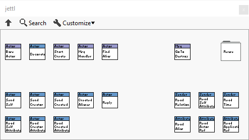
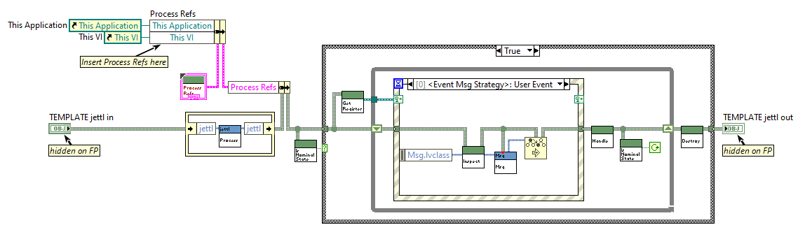
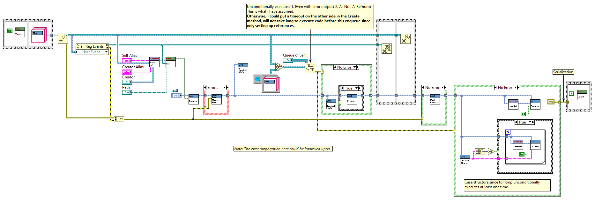

# jettl

*Dedicated to Stephen Loftus-Mercer for his pioneering work in introducing interfaces to the LabVIEW environment.*

*Please message me with your suggestions on how I can demonstrate more clear explanations, what I can do to improve the codebase for the developers needs, and examples you'd like to see.*

`jettl` is an object-oriented interface-composition based LabVIEW Actor Model library used for asynchronous processing of messages.
The framework is based upon SOLID friendly design patterns including the Strategy Pattern and Decorator Pattern.
SOLID principles, especially dependency inversion/injection, are used throughout the code base to encourage the developer to depend on abstractions.
Many advanced concepts are used, but not described, for simplicity.

**Install on [VIPM](https://www.vipm.io/package/nathan_davis_lib_jettl/)**

[jettl Discord](https://discord.gg/tVkvTyBxqa) for conversation and questions.

[jettl videos](https://www.youtube.com/@nathandavis6612) for developed examples and methodology of design.

The framework is extended to work with other frameworks and design patterns.
The source code is included for the jettl library along with the jettl Tools that help speed the process of development.

## Motivation

Over the the course of a couple years, I have designed applications to interface instruments for control of nuclear fusor, control XY stage motors to correlate and display 3D images via the data from a topological scanning laser, perform PID autotune algorithms for high efficiency RF antenna matching circuits, and control mass flow controllers for pressure and flow measurement, mocking a subsystem of a reactive ion etch system.
These applications have been written using the [National Instruments Actor Framework](https://education.ni.com/badges/resources/984/actor-framework).
Through the process, I learned about the [SOLID Design Principles](https://en.wikipedia.org/wiki/SOLID) and [Design Patterns](https://en.wikipedia.org/wiki/Software_design_pattern).
I had been eager to apply these principles and design patterns to my own Actor Model.
Being intimately involved with the source code of the [Actor Framework](https://education.ni.com/badges/resources/984/actor-framework), I ventured to build this `jettl` library.
It follows the Actor Model and takes great inspiration from the Actor Framework, Derrick Bommarito's [lv-artifex](https://github.com/illuminated-g/lv-artifex), and ideas presented in the many talks given by [Dmitry Sagatelyan](https://forums.ni.com/t5/LabVIEW-Champions-Directory/LabVIEW-Champion-Dmitry-Sagatelyan/ta-p/3536802) on the Agile Software Design Principles, SOLID principles, and Context-Agnostic Actors.
This work would not be possible without the contributions of those developers that have come before me.

## Advantage

- **Relative Actor Relations**.
Every Actor in the system has itself, called `Self`.
Along with one `Creator` and N many `Created` Actors.
- **Address Abstaction**.
The address of an Actor is fully abstracted away to the developer.
- **Messaging**.
Actor messaging follow a strict tree hierarchy of messaging .
Actors internally use events to send messages.
These messages are exclusively interface driven messages, fully abstracting the dependence between Actors.
- **Composition over inheritance**.
More specifically, interface composition.
Interface composition allows for dynamic wrapping of classes via their common interface.
In particular, debugging, unit testing, swapping panels, etc.

## Examples

The `Examples` folder has some examples that can be run.
Note, that these are used in reference to the jettl build package.

### Further Examples To Be Made
- Dedicate methods for `Show Panel`, `Hide Panel`, `Change Panel`
- Interchanging Panels
- Subpanel example
- `Periodic Message` example

## Debugging

Debug / Unit Test class wrapping.
Some kind of diagram disable in the developed actor `Decorator.vi`, surrounding the (yet to be made) `Debug.lvclass`.
That way debug code does not exist in Base classes, and is held exclusively in the `Base Debug.lvclass` / `Debug.lvclass` interface.

## Documentation

Look in the `doc` folder for the `main.pdf` for the ongoing documentation for `jettl`.
Note, this documentation will likely be outdated.
Please refer to the YouTube videos instead, linked above.
*These images are high resolution, click them to zoom in and see the simple algorithm of data flow.*

### Test Panel
Automatically generated test panel providing controls / necessary inputs for all messages the actor expects.
have the test panel display payloads from messages received.
This “Test Panel” is integrated as a part of the actor itself.
This is to design modular Actors without dependencies of other Actors.
Advanced: Potentially which messages the Actor is able to send and to which relative actor.
